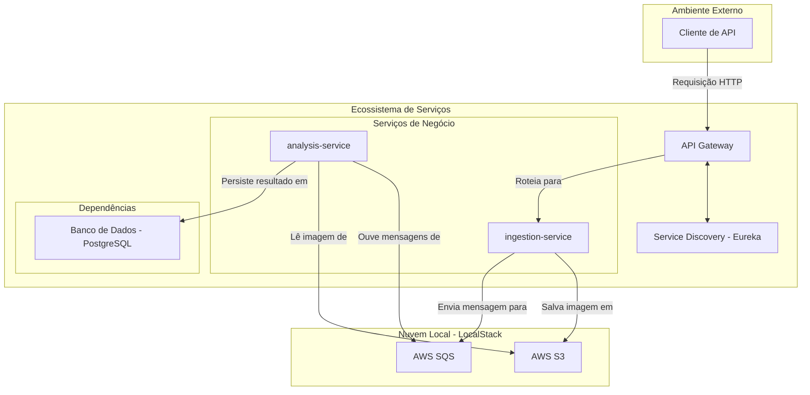

# Arquitetura do Sistema: Sentinel Pipeline

**Versão:** 1.0
**Data:** 24/06/2025

## 1. Visão Geral da Arquitetura

Para este projeto, optei por uma arquitetura de microsserviços para refletir os ambientes de produção modernos e para praticar o desacoplamento de responsabilidades. A arquitetura é composta por dois serviços de negócio principais, um gateway de API para centralizar o acesso e serviços de suporte para descoberta de serviço e comunicação assíncrona.

A escolha por essa abordagem, mesmo para um projeto de escopo definido, visa demonstrar a habilidade de projetar sistemas que são escaláveis, resilientes e fáceis de manter. Todo o ecossistema será executado em contêineres Docker, garantindo portabilidade e consistência entre os ambientes de desenvolvimento e produção.

## 2. Diagrama de Componentes

3. Descrição dos Componentes
API Gateway (Spring Cloud Gateway)
Atuando como a porta de entrada única ("Single Point of Entry") para todas as requisições externas. Ele é responsável por rotear o tráfego para o serviço apropriado, além de ser o local ideal para implementar futuramente responsabilidades transversais como segurança (autenticação/autorização) e rate limiting.

Service Discovery (Eureka)
Para que os serviços se encontrem dinamicamente em um ambiente containerizado, o Eureka atuará como um registro central. Cada microsserviço, ao iniciar, se registra no Eureka, permitindo que o API Gateway e outros serviços descubram sua localização na rede.

ingestion-service
Este serviço tem uma responsabilidade única e bem definida: receber o upload de imagens, validá-las e iniciar o pipeline de processamento. Desenvolvido em Spring Boot, ele orquestra a primeira parte do fluxo, interagindo com o S3 para armazenamento e com o SQS para delegar a tarefa de análise.

analysis-service
O segundo serviço principal, também em Spring Boot. Sua função é processar as tarefas de análise de forma assíncrona. Ele fica "ouvindo" a fila SQS, e ao receber uma nova mensagem, busca a imagem correspondente no S3, executa a lógica de análise simulada e, por fim, persiste o resultado no banco de dados.

Banco de Dados (PostgreSQL)
A escolha para a persistência dos resultados da análise recai sobre o PostgreSQL, um banco de dados relacional robusto e amplamente utilizado no mercado. Ele será acessado exclusivamente pelo analysis-service.

LocalStack (S3 & SQS)
Uma peça chave para o desenvolvimento deste projeto. O LocalStack simula os serviços da AWS na minha máquina local, o que permite desenvolver e testar a integração com S3 (para armazenamento de objetos) e SQS (para mensageria) sem nenhum custo e com alta fidelidade ao ambiente de produção na nuvem.

4. Fluxo de Dados Detalhado
O fluxo de uma requisição de ponta a ponta ocorre da seguinte maneira:

O Cliente de API envia uma requisição POST /v1/images com um arquivo de imagem para o API Gateway.
O API Gateway, após consultar o Eureka para encontrar a localização do serviço de ingestão, encaminha a requisição para uma instância disponível do ingestion-service.
O ingestion-service valida a imagem e a envia para o bucket configurado no AWS S3 (via LocalStack).
Após a confirmação do upload no S3, o mesmo serviço publica uma mensagem na fila do AWS SQS (via LocalStack), contendo o identificador da imagem. Em seguida, retorna uma resposta de sucesso (202 Accepted) para o cliente com o ID da imagem.
Independentemente, o analysis-service está continuamente escutando a fila no SQS. Ao detectar a nova mensagem, ele a consome.
O serviço de análise usa o identificador da mensagem para buscar o arquivo de imagem correspondente no S3.
Ele executa a lógica de análise simulada sobre a imagem.
Finalmente, o resultado da análise é salvo na tabela apropriada no banco de dados PostgreSQL.
