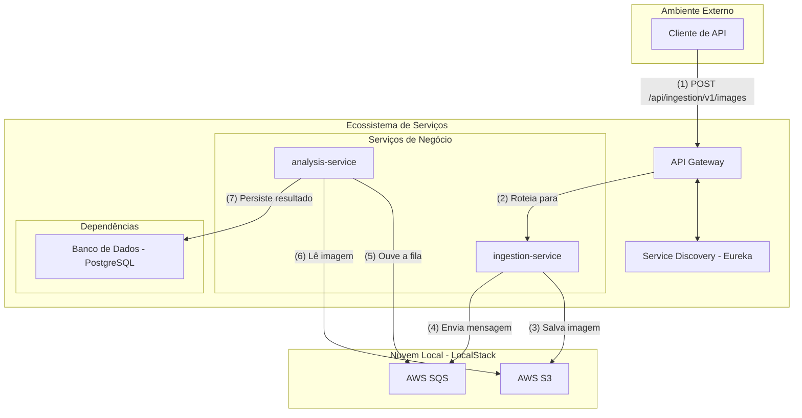

# Sentinel Pipeline 🛰️


-S3_&_SQS-232F3E?style=for-the-badge&logo=amazon-aws)


Um pipeline de processamento de imagens assíncrono, construído com uma arquitetura de microsserviços para demonstrar habilidades em sistemas distribuídos, nuvem e boas práticas de desenvolvimento backend.

## 📖 Sobre o Projeto

O Sentinel Pipeline é um projeto de portfólio que simula um sistema de análise de imagens de satélite. Ele foi projetado para ser um exemplo prático de uma arquitetura robusta, resiliente e escalável, utilizando tecnologias amplamente requisitadas no mercado.

O fluxo principal consiste em receber uma imagem via API, armazená-la de forma segura e enfileirar uma tarefa de análise que é processada em background, de forma totalmente assíncrona e desacoplada.

## 🏛️ Arquitetura

O diagrama abaixo ilustra os componentes do sistema e o fluxo de dados principal, desde a requisição do cliente até a persistência do resultado da análise. A arquitetura foi desenhada para ser clara, com responsabilidades bem definidas para cada microsserviço.


🛠️ Tecnologias Utilizadas

Linguagem: Java 17+
Framework Principal: Spring Boot 3
Microsserviços: Spring Cloud Gateway, Spring Cloud (Eureka)
Comunicação Assíncrona: Spring Cloud AWS SQS
Armazenamento de Objetos: Spring Cloud AWS S3
Banco de Dados: PostgreSQL
Containerização: Docker & Docker Compose
Simulador de Nuvem: LocalStack

## 🚀 Como Executar

Para executar o projeto em sua máquina local, o processo é bem simples. A única configuração manual é automatizada por um script Python.

### Pré-requisitos
* Git
* Java (JDK) 17 ou superior
* Docker e Docker Compose
* Python 3.8+ e Pip

### Passos para a Execução

1.  **Clone o repositório:**
    ```bash
    git clone A url do repo
    cd sentinel-pipeline
    ```

2.  **Suba todo o ambiente com Docker Compose:**
    Este comando irá construir e iniciar todos os contêineres. Execute em um terminal e deixe-o rodando para manter os serviços de pé.
    ```bash
    docker-compose up --build
    ```
    Aguarde até que os logs se estabilizem.

3.  **Execute o script de configuração do ambiente:**
    Abra um **novo terminal**. O script abaixo irá criar o bucket S3 e a fila SQS necessários dentro do LocalStack.

    * **Instale a única dependência necessária:**
        execute:
        ```bash
        pip install -r requirements.txt
        ```

    * **Rode o script de setup:**
        ```bash
        python setup_local_aws.py
        ```

Pronto! Seu ambiente está configurado e pronto para receber requisições.

<details>
<summary>Clique para ver o código do script 🐍: <code>setup_local_aws.py</code></summary>

```python
# setup_local_aws.py
import boto3
from botocore.exceptions import ClientError

# --- Configuração ---
LOCALSTACK_ENDPOINT_URL = 'http://localhost:4566'
S3_BUCKET_NAME = 'satellite-images'
SQS_QUEUE_NAME = 'image-analysis-queue'
AWS_REGION = 'us-east-1' # Região padrão do LocalStack

# Clientes Boto3 apontando para o LocalStack
s3_client = boto3.client(
    's3',
    endpoint_url=LOCALSTACK_ENDPOINT_URL,
    region_name=AWS_REGION
)

sqs_client = boto3.client(
    'sqs',
    endpoint_url=LOCALSTACK_ENDPOINT_URL,
    region_name=AWS_REGION
)

def create_resources():
    """Cria o bucket S3 e a fila SQS se eles não existirem."""
    print("--- Configurando recursos na nuvem local (LocalStack) ---")
    
    # Criar bucket S3
    try:
        s3_client.create_bucket(Bucket=S3_BUCKET_NAME)
        print(f"✅ Bucket '{S3_BUCKET_NAME}' criado com sucesso.")
    except ClientError as e:
        if e.response['Error']['Code'] == 'BucketAlreadyOwnedByYou' or e.response['Error']['Code'] == 'BucketAlreadyExists':
            print(f"ℹ️  Bucket '{S3_BUCKET_NAME}' já existe. Pulando.")
        else:
            print(f"❌ Erro inesperado ao criar bucket: {e}")
            raise e

    # Criar fila SQS
    try:
        sqs_client.create_queue(QueueName=SQS_QUEUE_NAME)
        print(f"✅ Fila '{SQS_QUEUE_NAME}' criada com sucesso.")
    except ClientError as e:
        print(f"ℹ️  Fila '{SQS_QUEUE_NAME}' provavelmente já existe ou ocorreu um erro. Pulando. Detalhe: {e}")


if __name__ == "__main__":
    print("🚀 Iniciando script de configuração de recursos... 🚀")
    create_resources()
    print("\n🎉 Ambiente configurado com sucesso! 🎉")
```

📝 Status do Projeto
Status: 企画 (Kikaku - Em Planejamento) - Pronto para iniciar o desenvolvimento!!
