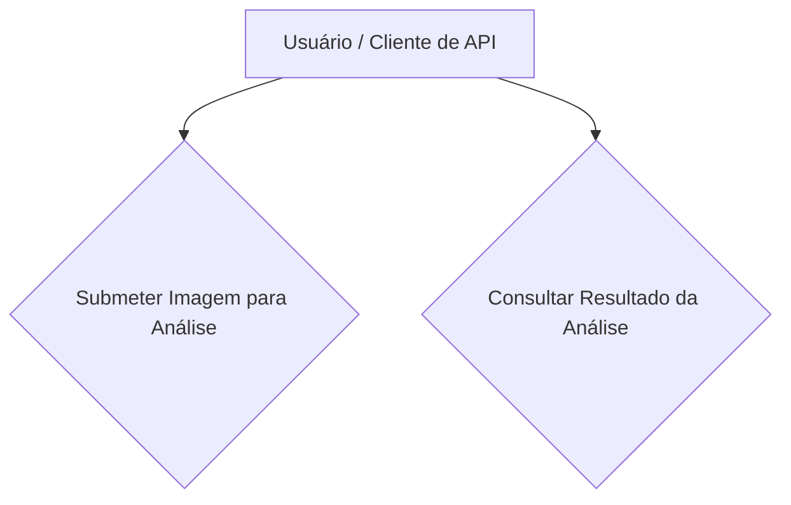

# Requisitos do Meu Projeto: Sentinel Pipeline

**Versão:** 1.0
**Data:** 24/06/2025

## 1. Introdução

Neste documento, eu vou detalhar os requisitos funcionais e não-funcionais que defini para a primeira versão do meu projeto, o Sentinel Pipeline. Meu objetivo aqui é criar um guia claro para mim mesmo sobre o que preciso construir, quais as capacidades que o sistema terá e quais as restrições e metas de qualidade que estou estabelecendo para o desenvolvimento.

## 2. Atores do Sistema

Para este projeto, eu imaginei um único ator principal: o **Usuário** ou **Cliente de API**. Ele representa a pessoa ou o sistema que irá interagir com a API que vou construir, seja para enviar imagens ou para verificar os resultados das análises.

## 3. Casos de Uso

Como o diagrama mostra, meu plano é focar em duas interações centrais: permitir que o usuário submeta uma imagem e, depois, que ele possa consultar o resultado da análise que meu sistema realizou.

4. Requisitos Funcionais (RF)
Aqui estão as funcionalidades específicas que eu vou implementar no sistema.

RF01: Submissão de Imagem para Análise
Eu preciso que o sistema exponha um endpoint REST (POST /v1/images) para que o usuário possa me enviar uma imagem. Vou configurar este endpoint para aceitar requisições multipart/form-data e vou adicionar uma validação para garantir que os arquivos sejam apenas nos formatos .jpg ou .png. Ao receber o arquivo com sucesso, a minha API devolverá um identificador único da imagem, para que o usuário possa rastreá-la depois.

RF02: Processamento Assíncrono da Imagem
Um ponto central da arquitetura que vou construir é o que acontece nos bastidores. Assim que uma imagem for recebida, meu sistema irá, de forma automática, guardá-la em um bucket S3 e, em seguida, enviar uma mensagem para uma fila SQS. Essa mensagem avisará a outra parte do meu sistema que há uma nova imagem para ser analisada.

RF03: Consulta de Resultado da Análise
Para fechar o ciclo, vou implementar um segundo endpoint (GET /v1/results/{imageId}). Usando o ID recebido no upload, o usuário poderá chamar esse endpoint para verificar o status. Se a análise ainda estiver acontecendo, minha API informará "EM PROCESSAMENTO". Quando estiver pronta, ela entregará um JSON com o resultado da análise que meu sistema simulou.

5. Requisitos Não-Funcionais (RNF)
Além das funcionalidades, eu estabeleci algumas metas e restrições técnicas para mim mesmo, para garantir a qualidade e o profissionalismo do projeto.

RNF01: Tecnologia e Ambiente
Eu vou desenvolver este projeto usando tecnologias que quero demonstrar proficiência: Java 17 (ou 21), Spring Boot 3 e PostgreSQL para o banco de dados. Um requisito pessoal é que todo o ambiente seja "dockerizado", ou seja, eu quero poder subir tudo (meus serviços, banco de dados e LocalStack) com um único comando docker-compose up.

RNF02: Desempenho da Ingestão
Eu quero que o endpoint de upload de imagem seja muito rápido. Minha meta é que o tempo de resposta para receber o arquivo e colocá-lo na fila seja inferior a 500 milissegundos, para que a experiência do usuário seja ágil. A análise em si, que é mais pesada, não vai afetar esse tempo.

RNF03: Assincronicidade e Desacoplamento
Um princípio fundamental que vou seguir é o desacoplamento. O serviço que recebe a imagem e o que faz a análise serão independentes. A comunicação entre eles será totalmente assíncrona, usando a fila SQS. Isso garante que um não dependa do outro para funcionar.

RNF04: Confiabilidade
Meu objetivo é construir um sistema confiável. Se o serviço de análise cair por algum motivo, eu não quero perder nenhuma imagem enviada. Graças à fila SQS, as tarefas ficarão aguardando e serão processadas assim que eu colocar o serviço de análise no ar novamente.
